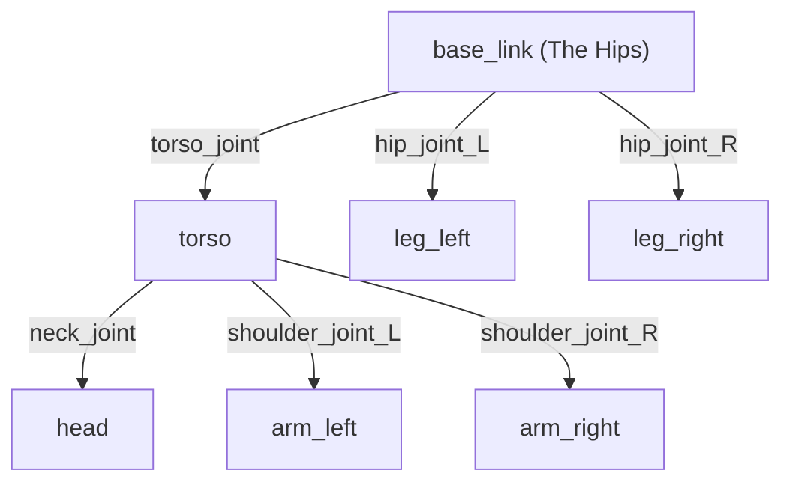

# Anatomy of a Humanoid: URDF and TF

<HeroBox title="The DNA of a Robot" variant="purple">
  <p>
    Before a robot can move, it needs a body. In ROS 2, this body is defined by a file format called <strong>URDF</strong>. It tells the software where the legs, arms, and eyes are attached.
  </p>
</HeroBox>

## Learning Objectives

By the end of this chapter, you will be able to:

-   Read and understand a URDF (Unified Robot Description Format) file.
-   Visualize the "Link" and "Joint" tree structure.
-   Explain the purpose of the **TF (Transform) Tree**.
-   Diagnose the "Ghost Robot" error in Rviz.

## 1. URDF: The DNA of the Robot

**URDF** (Unified Robot Description Format) is an XML format used to describe the kinematic and dynamic properties of a robot. It is essentially the "DNA" that tells the simulator (like Gazebo) and the visualizer (Rviz) what the robot looks like and how it moves.

It consists of two main elements:

### Links (The Bones)
A **Link** describes a rigid body part (e.g., `base_link`, `thigh`, `shin`, `foot`).
It contains:
*   **Visual:** What it looks like (meshes, cylinders, boxes).
*   **Collision:** The simplified geometry used for physics calculations.
*   **Inertial:** Mass and Moment of Inertia (crucial for physics simulation).

```xml
<link name="base_link">
  <visual>
    <geometry>
      <box size="0.5 0.5 0.2"/>
    </geometry>
  </visual>
</link>
```

### Joints (The Muscles/Hinges)
A **Joint** describes how two links are connected and how they move relative to each other.
*   **Type:** `revolute` (hinge), `continuous` (wheel), `prismatic` (slider), or `fixed` (sensor mount).
*   **Parent & Child:** Defines the hierarchy (e.g., `base_link` holds `torso`).
*   **Limits:** Range of motion and max velocity.

```xml
<joint name="torso_joint" type="revolute">
  <parent link="base_link"/>
  <child link="torso"/>
  <origin xyz="0 0 0.2" rpy="0 0 0"/>
  <axis xyz="0 0 1"/>
</joint>
```

### Visualizing the Tree
Every robot starts from a central point, usually called `base_link` or `world`. Everything else branches off from there in a tree structure.



## 2. The TF Tree (Transforms)

Knowing the static structure (URDF) isn't enough. The robot needs to know where its hand is *relative* to its eyes in real-time as it moves. This is handled by the **TF (Transform) System**.

### The Concept
TF keeps track of the coordinate frames (X, Y, Z position and Rotation) of every link over time. It answers questions like:
> "Where is the `hand_link` relative to the `camera_link` right now?"

This allows you to take a point seen by the camera (in `camera_frame`) and know where it is relative to the hand (in `hand_frame`) so you can grab it.

### The Math: Quaternions
In 3D space, ROS 2 avoids "Gimbal Lock" by using **Quaternions** (x, y, z, w) instead of simple Euler angles (Roll, Pitch, Yaw) for rotation.
*   **Don't worry:** You rarely calculate these manually. ROS 2 libraries like `tf2_ros` and `tf2_geometry_msgs` handle the math for you.

## 3. Activity: Debug the Ghost Robot

One of the most common errors in robotics is the **"Ghost Robot"**.

**The Symptom:**
You open Rviz. You see your robot model, but the legs are floating 5 meters away from the body, or the head is spinning inside the chest. The robot looks "exploded" or transparent (white).

**The Cause:**
The **TF Tree is broken**.
*   **Missing Joint State:** The `joint_state_publisher` is not running, so the robot doesn't know the angle of its joints.
*   **Missing Transform:** A sensor frame (e.g., `lidar_link`) exists in the URDF but is not connected to the `base_link` via a joint or a `static_transform_publisher`.

**The Fix:**
1.  Run `ros2 run tf2_tools view_frames` to generate a PDF of the TF tree.
2.  Look for broken lines or disconnected trees.
3.  Ensure `robot_state_publisher` is running and publishing the URDF.

---

**Next:** It is time to prove your skills. Capstone Project: **The Blind Walker**.