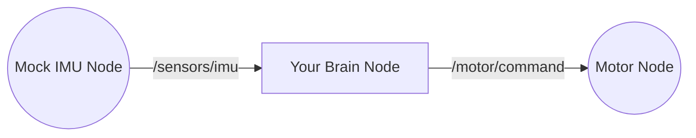

# Capstone Project: The Blind Walker

<HeroBox title="Can you save the robot?" variant="rose">
  <p>
    You have built the nervous system. Now you must build the reflex. Your robot is walking blind. If it starts to fall, your code must catch it before it hits the ground.
  </p>
</HeroBox>

## Assignment

**Goal:** Create a ROS 2 package where a "Brain Node" listens to a mock "IMU Node."

### The Logic
You need to implement a safety reflex:
1.  **Listen** to sensor data from `/sensors/imu`.
2.  **Check** if the robot is tilting too much.
3.  **Command** the motors to stop if a fall is imminent.

**Condition:**
If `tilt > 30.0` degrees OR `tilt < -30.0` degrees:
*   **Publish** `STOP` to `/motor/command`.

## Requirements

1.  **Language:** Python (`rclpy`).
2.  **Launch File:** Create a custom launch file named `walker.launch.py` that starts both your Brain Node and the provided Mock IMU Node.
3.  **Data Types:**
    *   Sensor Data: `std_msgs/Float32` (representing degrees of tilt).
    *   Motor Command: `std_msgs/String` (sending "STOP" or "WALK").

### Architecture



## Submission & Verification

To verify your solution, run the following test case:

1.  **Launch your package:**
    ```bash
    ros2 launch blind_walker walker.launch.py
    ```

2.  **Manually publish a "Fall" signal:**
    Open a new terminal and publish a tilt of 45 degrees.
    ```bash
    ros2 topic pub /sensors/imu std_msgs/msg/Float32 "{data: 45.0}"
    ```

3.  **Check the output:**
    Your node should print/log: **"EMERGENCY STOP! Tilt is 45.0"** and publish "STOP" to `/motor/command`.

---

**Congratulations!** You have completed Module 1. You have bridged the gap between the digital brain and the physical body.